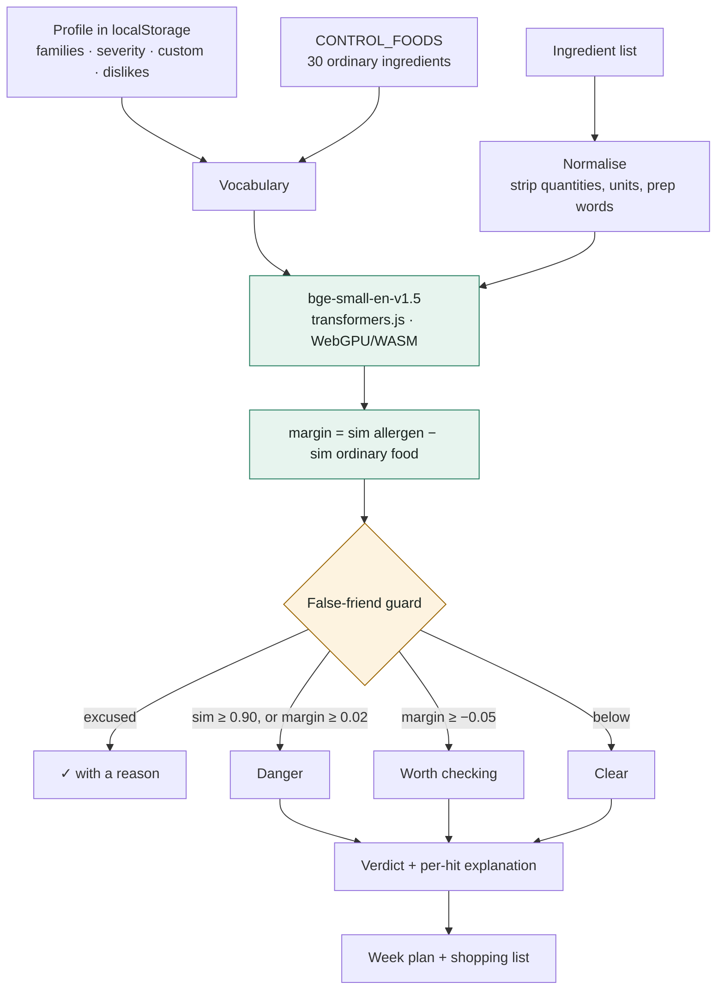

# SafePlate 🍽️

**An allergy-aware meal planner that catches the ingredient names nobody put on a list. Runs entirely on your own device.**

My flatmate is allergic to sesame and dairy. Cooking for them was fine until the evening I almost
served something containing *kataifi*, because I did not know kataifi was pastry, and the thing I was
carefully watching for was sesame. The usual tools are keyword lists, and keyword lists only catch
the words somebody already thought of.

SafePlate compares **meaning** instead of spelling. Every ingredient is embedded with
`bge-small-en-v1.5` running inside the browser tab and scored against the allergen families the
person actually reacts to. `labneh`, `surimi`, `panko`, `gomasio`, `freekeh` and `pignoli` all get
flagged. None of those words appear anywhere in this repository's vocabulary.

Measured on the 54-ingredient fixture set in [`tests/fixtures.js`](tests/fixtures.js):
**29 of 30 real allergens flagged, 1 false alarm out of 24 safe ingredients.** Run `npm test`.

---

## The thing I got wrong first, and why open weights saved it

The obvious design is a similarity threshold: embed the ingredient, embed `cheese`, flag it if cosine
similarity is above some number. I built that. Then I built a fixture set to pick the number, and the
fixture set said the design was broken:

```
burrata    -> mozzarella   0.43     should flag
rice flour -> flour        0.83     should NOT flag
tomato     -> pasta        0.55     should NOT flag
```

There is no threshold that puts `burrata` on one side and `rice flour` on the other. At the best
possible cut-off, the first version caught **7 of 30** allergens. Shipping it would have produced a
tool that felt clever and quietly missed three quarters of everything.

The cause is that sentence-embedding spaces are anisotropic: any two foods are already similar, so
the absolute number carries almost no information. The fix is to stop reading the absolute number.
Every ingredient is now also scored against `CONTROL_FOODS` — thirty ordinary, non-allergenic
ingredients — and what counts is the **margin**:

```
margin = similarity(ingredient, allergen family) - similarity(ingredient, ordinary food)
```

`tomato` is closer to ordinary food than to gluten, so its margin is negative and it passes.
`kataifi pastry` is closer to pastry than to anything in the control set, so it flags. Same model,
same vocabulary, one subtraction: **7 of 30 became 27 of 30.**

Only then was it worth comparing models, and the comparison was not about recall:

| | all-MiniLM-L6-v2 | **bge-small-en-v1.5** |
|---|---|---|
| Size (q8) | 22 MB | 35 MB |
| Allergens flagged | 27/30 | **29/30** |
| False alarms | 4 | **1** |
| Danger-level false alarms | 1 (`buckwheat flour` → gluten) | **0** |

A tool someone trusts with an allergy can survive being cautious. It cannot survive being
confidently wrong. 13 MB is a cheap price for that column.

**This is the part a closed API would have cost me.** Finding the margin trick took a few hundred
runs over the fixture set, then a few hundred more per candidate model, in a loop with no network
and no bill. A hosted classifier would have given me a label and hidden the score, so I would never
have seen that `rice flour` was scoring higher than `burrata` — I would have seen "not an allergen"
and assumed it worked. Owning the weights is what turned a plausible idea into a measured one. The
scores are on screen next to every hit for the same reason: someone deciding what to feed a friend
should be able to see how confident the machine is.

## The other hard part: false friends

A language model is confident that **coconut milk** is dairy. It is wrong, and that direction of
wrong is nearly as bad as a miss, because a planner that flags everything gets ignored by Wednesday.

So [`src/allergens.js`](src/allergens.js) carries an explicit `FALSE_FRIENDS` table — coconut milk,
almond flour, buckwheat, nutmeg, eggplant, cocoa butter, cream of tartar, nutritional yeast — each
naming the family it must *not* trigger and the reason, which is shown to the user:

> ✓ Coconut milk contains no dairy.

Guard rails beat threshold tuning. An ingredient can be excused from `dairy` while still flagging
`treenut`, which is exactly what almond milk should do. In the test run, the guard excuses 7 of the
8 ingredients that would otherwise have tripped.

## What it does

- **Profile** — 16 allergen families with per-person severity, plus free-text custom allergens and a
  separate list for things they merely dislike. Stored in this browser only.
- **Scan** — paste any ingredient list. Each line is normalised ("2 tbsp of finely chopped flat-leaf
  parsley" → "flat-leaf parsley"), embedded, and scored. Every hit shows what it matched, why, and
  the similarity.
- **Hidden sources** — allergens behind a process word: soy sauce contains wheat, worcestershire
  contains anchovy, burger buns contain sesame.
- **Plan a week** — scores a 22-recipe bank against the profile, then builds seven dinners from the
  ones that pass, penalising repeated cuisines so the week is not the same dinner seven times.
- **Shopping list** — grouped by supermarket aisle, exportable as Markdown.

## Architecture



Nothing there is a network call, apart from the one-time 35 MB model download the browser caches.

## Run it

```bash
git clone https://github.com/VanshajPoonia/safeplate
cd safeplate
python3 -m http.server 8000
# open http://localhost:8000
```

Static files. No build step, no bundler, no keys. The app itself has **zero runtime dependencies** —
`transformers.js` loads from a CDN and the weights come from the Hugging Face Hub. Deploys to GitHub
Pages as-is.

**Fastest way to see the point:** tick *Dairy*, *Gluten*, *Sesame*, *Shellfish* and *Tree nuts* on
the profile tab, save, go to *Check a recipe*, hit **Load the hard examples**, and scan.

### Reproduce the measurements

```bash
npm install                                  # dev-only, for the test runner
npm test                                     # bge-small: 29/30 flagged, 1 false alarm
MODEL=Xenova/all-MiniLM-L6-v2 npm test       # MiniLM: 27/30 flagged, 4 false alarms
```

## Thresholds

All in one object at the top of [`src/scan.js`](src/scan.js).

| Condition | Verdict | Meaning |
|---|---|---|
| similarity ≥ 0.86 to a false friend | ✓ excused | Explicitly not that allergen, reason shown |
| similarity ≥ 0.90 | **Danger** | Effectively the same ingredient |
| margin ≥ 0.02 and similarity ≥ 0.65 | **Danger** | Much closer to the allergen than to ordinary food |
| margin ≥ −0.05 | **Worth checking** | Resembles it, or is a common hidden source |
| below | Clear | No meaningful resemblance |

Change them, run `npm test`, see what breaks. That loop is the advantage of owning the model.

## Honest limitations

**This is a cooking aid, not a medical device.** It will catch things you would have missed. It will
not catch everything, and it cannot see cross-contamination, shared fryers, or a manufacturer
changing a recipe. Read the label. For anaphylactic allergies the label is the authority and this is
a second pair of eyes.

- **Known miss:** `gianduja` (a hazelnut chocolate) scores below threshold for tree nuts. It is
  recorded in `KNOWN_MISSES` rather than quietly added to the vocabulary, because a seed list that
  absorbs every failure stops being a test of generalisation.
- **Known false alarm:** `fresh parsley` draws a soft "worth checking" against gluten.
- The recipe bank is 22 dishes — a demonstration, not a cookbook. `data/recipes.json` is plain JSON.
- bge-small is an English model. Ingredient names in other scripts will not embed meaningfully.
- Severity affects ranking and wording, not the thresholds.

## Project layout

```
index.html            three tabs, one page
assets/styles.css     light + dark, no framework
src/allergens.js      16 families, false friends, hidden sources, control foods
src/embed.js          model pipeline, embedding cache, cosine
src/scan.js           normalisation, margin scoring, thresholds — the interesting file
src/planner.js        week building and shopping list
src/app.js            UI wiring
data/recipes.json     22-recipe bank
tests/fixtures.js     54 labelled ingredients
tests/run.mjs         reproduces every number in this README
```

## License

MIT. The bge-small-en-v1.5 weights are MIT from BAAI, served via the Hugging Face Hub.
